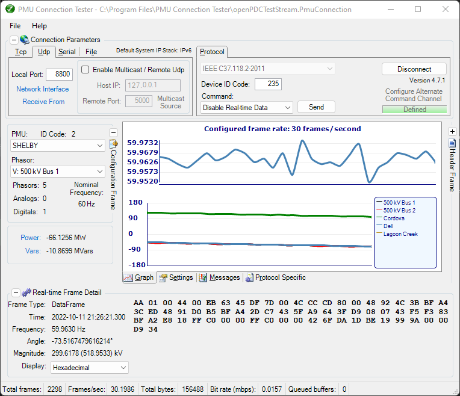

# PMU Connection Tester

The PMU Connection Tester is a Windows GUI application used to validate, test and trouble‐shoot
connections and data streams from phasor measurement devices as well as graphically visualize
their synchophasor data in real‐time.

## Overview

The PMU Connection Tester verifies that the data stream from any known phasor measurement device is being received. Device types that can be tested through the PMU Connection Tester application may include:
* Phasor Measurement Unit (PMU)
* Phasor Data Concentrator (PDC)
* Digital Fault Recorder (DFR)
* Power Quality Meter (PQ)

Any device that supports one of the following phasor protocols may be tested:
* IEEE C37.118.2-2011
* IEEE C37.118-2005 (Version 1/Draft 7, Draft 6)
* IEC 61850-90-5 (starting with version 4.3)
* IEEE 1344-1995
* BPA PDCstream (Revisions 0, 1, and 2, including PDCxchng formatted data)
* UTK F-Net
* SEL Fast Message
* Macrodyne (M and G starting with version 4.3)

## Documentation and Support

* Documentation for PMUConnectionTester can be found [here](https://pmuconnectiontester.info//HELP).
* Get in contact with our development team on our new [discussion board](http://discussions.gridprotectionalliance.org/c/gpa-products/pmu-connection-tester).

## Deployment

> Make sure your system meets all the requirements below.
* Download the [latest stable release](#latest-stable-release) below.
* Unzip if necessary.
* Start the correct installer for your system (32-bit or 64-bit).
* Follow the wizard.
* Enjoy.

### Requirements

* .NET 4.6 or higher.

### Latest Stable Release

* Download the latest stable release [here](https://github.com/GridProtectionAlliance/PMUConnectionTester/releases).

## Contributing
If you would like to contribute please:

* Read our [styleguide](https://www.gridprotectionalliance.org/docs/GPA_Coding_Guidelines_2011_03.pdf).
* Fork the repository.
* Make something amazing.
* Create a pull request.

## License
PMU Connection Tester is licensed for use under the [MIT License](../LICENSE)
