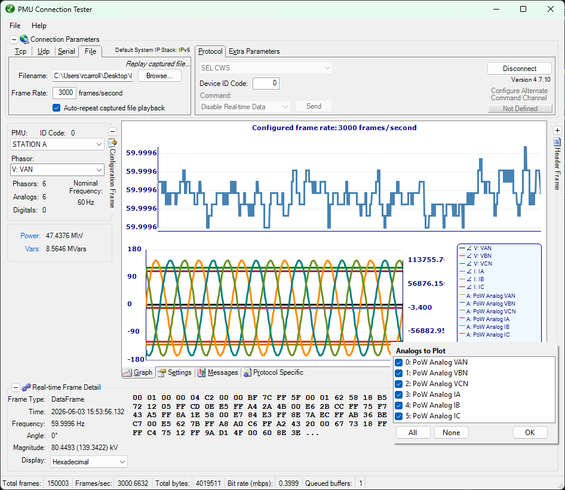

# PMU Connection Tester

The PMU Connection Tester is a Windows GUI application used to validate, test and trouble‐shoot
connections and data streams from phasor measurement devices as well as graphically visualize
their synchophasor data in real‐time.

## Overview

The PMU Connection Tester verifies that the data stream from any known phasor measurement device is being received. Device types that can be tested through the PMU Connection Tester application may include:
* Phasor Measurement Unit (PMU)
* Phasor Data Concentrator (PDC)
* Digital Fault Recorder (DFR)
* Power Quality Meter (PQ)

Any device that supports one of the following phasor protocols may be tested:
* IEEE C37.118.2-2011
* IEEE C37.118-2005 (Version 1/Draft 7, Draft 6)
* IEC 61850-90-5 (starting with version 4.3)
* IEEE 1344-1995
* BPA PDCstream (Revisions 0, 1, and 2, including PDCxchng formatted data)
* UTK F-Net
* SEL Fast Message
* Macrodyne (M and G starting with version 4.3)
* SEL CWS — point-on-wave (PoW) streaming (starting with version 4.7); synchrophasors, frequency and ROCOF are derived in real time from the streamed waveform samples

## Real-Time Visualization

As data is received it is graphed live. Alongside the phase-angle and frequency trends, the graph screen supports:

* **Analog plotting** — plot analog channels (such as the point-on-wave samples streamed by SEL CWS) as trends together with the phasor data. Phasors and analogs are kept on opposite Y axes, and either type can be assigned to the primary (left) or secondary (right) axis.
* **Right-click channel selection** — right-click directly on the graph to choose which phasors or analogs are plotted: the left half of the chart selects the channels on the primary axis and the right half selects those on the secondary axis. The same selections are also available from the property-grid settings.

When connected to a high frame-rate source — for example SEL CWS point-on-wave at 3000 frames per second — trends automatically switch from spline to straight-line rendering above a configurable frame-rate threshold (set under **Chart Settings**, default 500) to keep the display responsive; normal synchrophasor rates retain the smoother spline appearance.

## Documentation and Support

* Read [Documentation for PMUConnectionTester](https://pmuconnectiontester.info//HELP).
* Get in contact with our development team on our new [discussion board](http://discussions.gridprotectionalliance.org/c/gpa-products/pmu-connection-tester).

## Deployment

> Make sure your system meets all the requirements below.
* Download the [latest stable release](#latest-stable-release) below.
* Unzip if necessary.
* Start the correct installer for your system (32-bit or 64-bit).
* Follow the wizard.
* Enjoy.

### Requirements

* .NET Framework 4.8 or higher.

### Latest Stable Release

* Download the latest stable release [here](https://github.com/GridProtectionAlliance/PMUConnectionTester/releases).

## Contributing
If you would like to contribute please:

* Read our [styleguide](https://www.gridprotectionalliance.org/docs/GPA_Coding_Guidelines_2011_03.pdf).
* Fork the repository.
* Make something amazing.
* Create a pull request.

## License
PMU Connection Tester is licensed for use under the [MIT License](../LICENSE)
